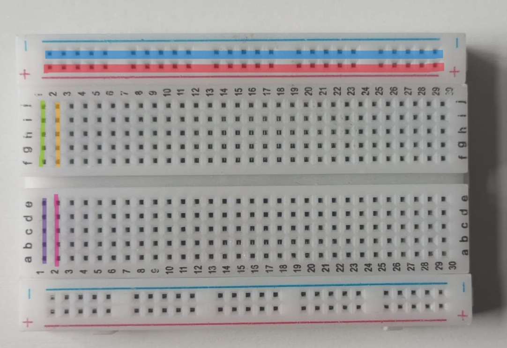
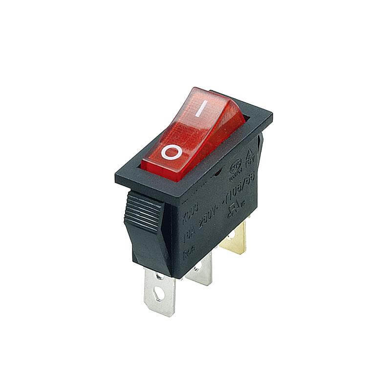
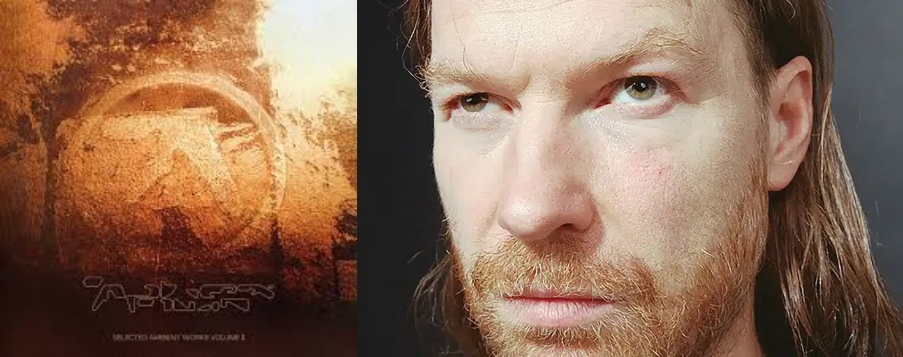

# sesion-01b

## inputs: entregan la energía o información

## output: salida de datos

## protoboard

- canal central: aísla la zona inferior y superior
- buses: Líneas horizontales más largas, por lo general, para conectar la tierra (línea azul) y el voltaje (línea roja).
- pistas: demás orificios conectados verticalmente entre sí (verde conectado entre sí, morado conectado entre sí. Verde y morado no se conectan)

también existe las "Perfboard" y las "Stripboard" y además hay de distintos tamaños, grande, mediana y chica.

## interruptor 250v

interrumpe el camino de la electricidad. encendido y apagado

## potenciómetro

permite controlar la corriente, generalmente usado en sonido, puede regular volumen y tono

## condensadores electrolítico y de cerámica

almacena energía eléctrica. no tienen polaridad

## resistencias

es la oposición a la circulación de corriente. se mide en Ohm (Ω). el código de colores indica el valor

## LED

Light-Emitting Diode. fuente de luz. el voltaje que necesitan depende del color. para no quemarlos se usan resistencias. tiene un positivo y un negativo

## buzzer o zumbador

convierten la electricidad en sonido. el sonido cambia dependiendo del tamaño y el voltaje

## servomotor

se puede controlar la posición y el movimiento de forma precisa

## Encargo 02

### Aphex twin

Lo primero que hice fue buscarlo en spotify y ponerle play. Empezó a sonar "#17" del álbum Selected Ambient Works Volume II (SAW2) de 1994. La canción me recordó al soundtrack de minecraft. Investigué y resulta que C418 reconoció que se ha influenciado en Aphex Twin en su música.

Mientras escuchaba, investigué sobre el artista irlandés Richard David James, conocido como Aphex Twin, un productor de música electrónica de estilos como techno, ambient, braindance (IDM - música inteligente), acid y drum and bass. Su nombre está inspirado en un fabricante de equipos de procesamiendo de audio Aphex Systems Limited y la palabra "twin" que significa gemelo, en referencia a su hermano mayor llamado Richard James, el cual murió al nacer.

Luego busqué información sobre el álbum, el cual fue publicado en 1994 y es el seguno álbum de Aphex Twin. Se basa en el estilo musical Ambient con percusiones minimalistas o inexistentes. Aphex lo compara con "estar en una central eléctrica bajo los efectos del ácido"

> Me salió "QKThr" que aparece en Tik Tok y no tenía idea de quién era hasta ahora.

### fuentes
 
-  Aphex Twin. (s/f). Last.fm. <https://www.last.fm/es/music/Aphex+Twin/+wiki>

- Wikipedia contributors. (s/f). Selected Ambient Works II. Wikipedia, The Free Encyclopedia. <https://es.wikipedia.org/w/index.php?title=Selected_Ambient_Works_II&oldid=153834461>

- The aphex twin community / learn / interviews & articles / lost in space. (s/f). Aphextwin.nu. <https://www.aphextwin.nu/learn/98136154898147.shtml>