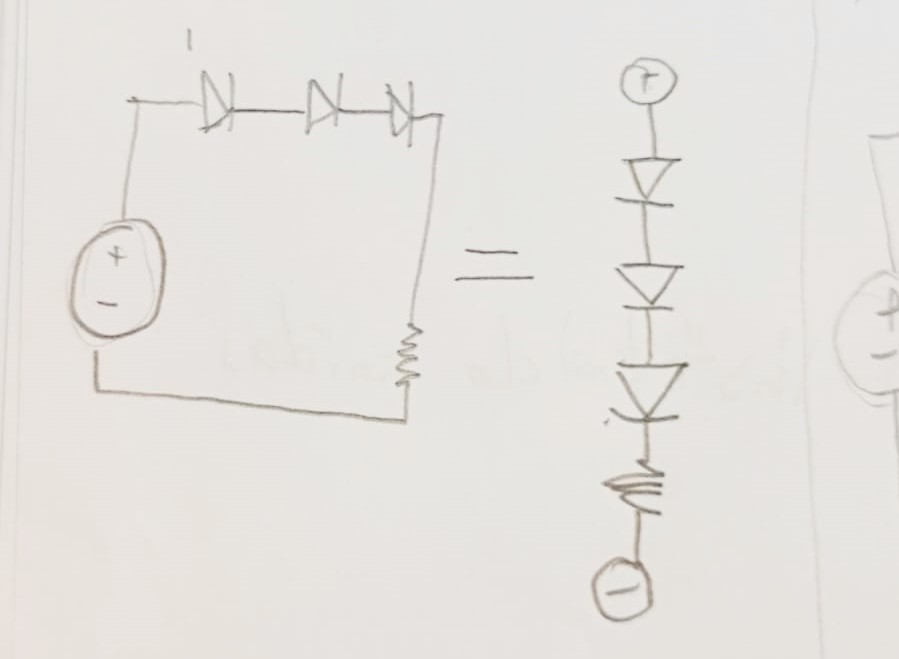

# sesion-02a

## referencias y ayudas

- **[nime](https://nime.org/)**
- ig @relinchafestival
- **[pueblo nuevo](https://pueblonuevo.cl/)**
  - historial de caída
- atista muscal **lars from mars**
- ig @mikamartini
- **[plantilla perfil de github](https://rahuldkjain.github.io/gh-profile-readme-generator/)**
- <https://archive.org/>
- **[guía para markdown 1](https://www.markdownguide.org/)**
- **[guía para markdown 2](https://github.com/adam-p/markdown-here/wiki/Markdown-Cheatsheet)**
- **[símbolo de circuitos](https://www.bbc.co.uk/bitesize/articles/zqryn9q#zfx44xs)**
- **[cálculadora de resistencias](https://www.digikey.com/es/resources/conversion-calculators/conversion-calculator-resistor-color-code)**
- **[cálculo resistencias para LEDs](https://www.digikey.com/es/resources/conversion-calculators/conversion-calculator-led-series-resistor)**

### lenguaje

el texto puede teminar en .txt o .md
todo se escribe en minúsculas y sin espacio: carpetaNueva (la mejor opción) - carpeta.nueva - carpeta_nueva

## circuitos

electricidad como caudal:

### serie

la electricidad tiene sólo un camino

sin un led no funciona, se **interrumpe** el camino

### paralelo

la elecrticidad tiene más de un camino

al tener varios caminos, si falta un led, igual **funciona**

## Encargo 04

Escuché el disco *Sandía* de Pablo FLores, publicado en febrero de 2025. Pablo dijo que, mientras trabajaba en el álbum, David Bowie lo acompañó con su frase *“I think most artists feel a lot happier, discussing the process of what they do, rather than what the hell it means. I know so many painters who title their works after they’ve done them, which is a real giveaway.”*.

Su obra nace desde lo abstracto y emocional, busca *"transformar la experiencia en algo sonoro más que conceptual"* y espera que sea *"una llamada a no olvidar lo que realmente importa: a cuidar y amar a los unos a los otros, sin importar lo que el mundo nos quiera imponer."*

- Sandía. (2025, febrero 26). Pueblo Nuevo Netlabel. <https://pueblonuevo.cl/catalogo/sandia/>