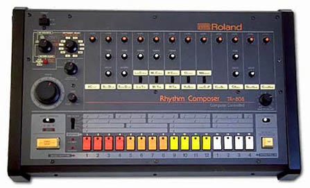
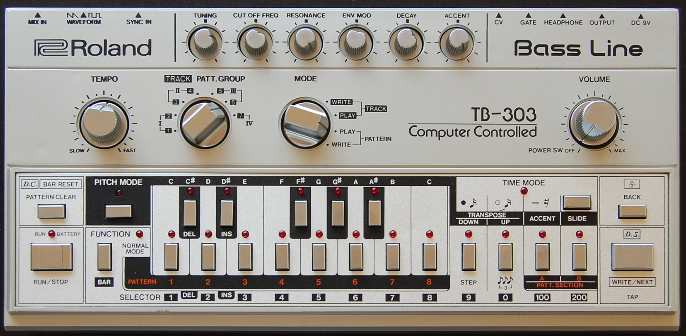
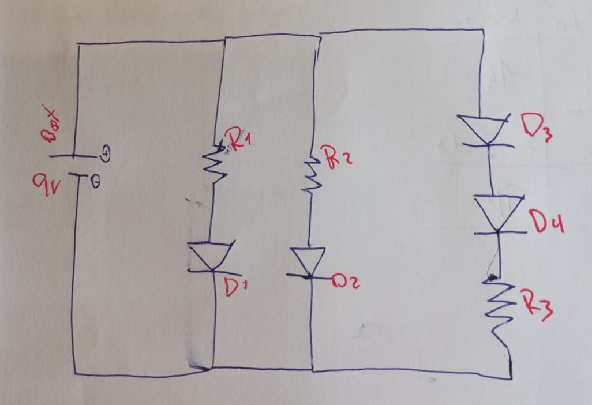
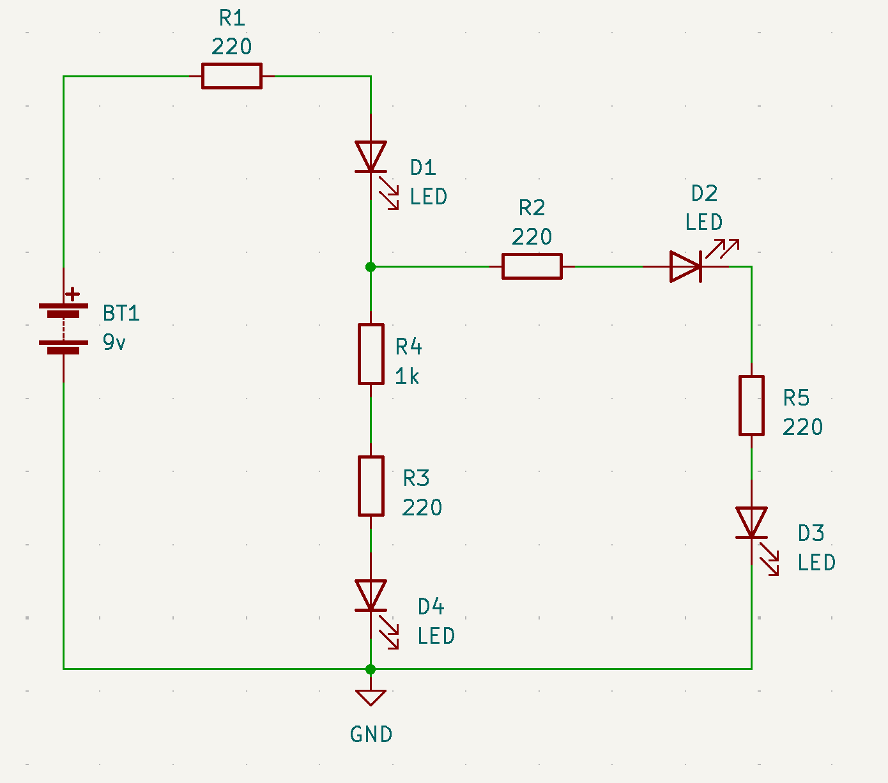
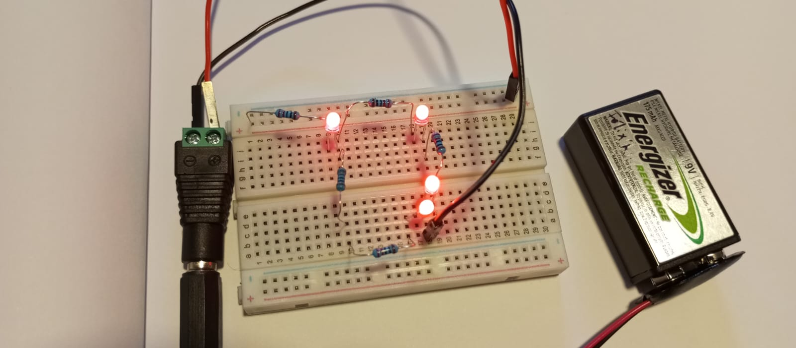
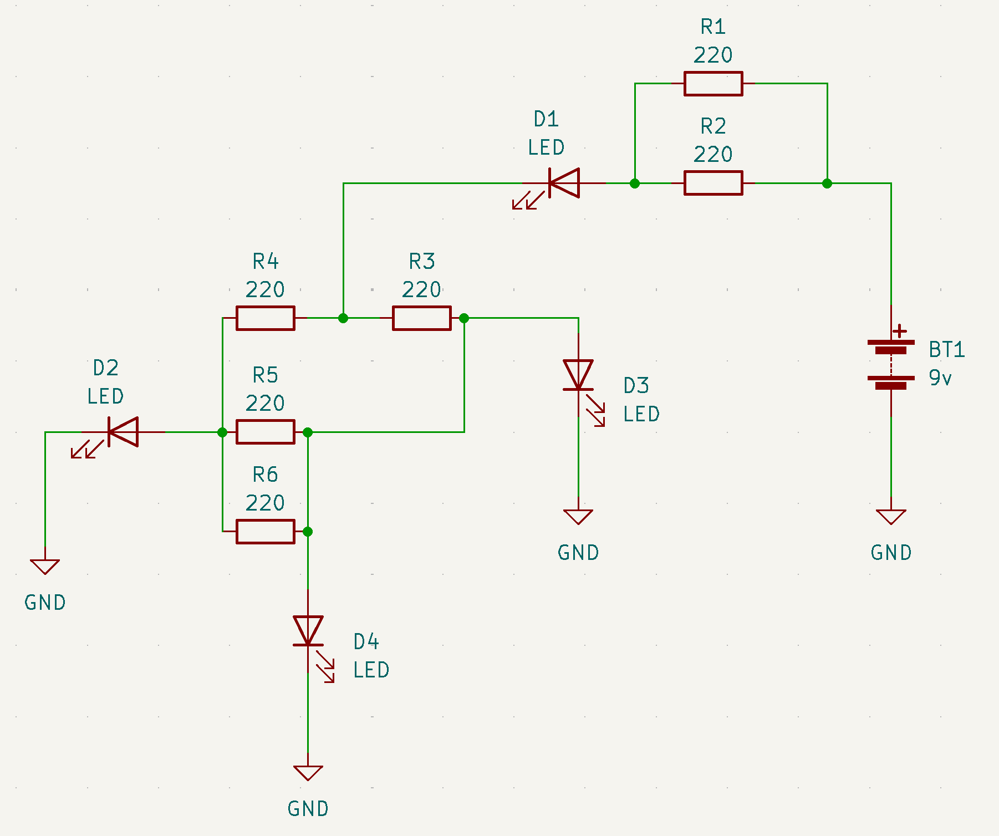
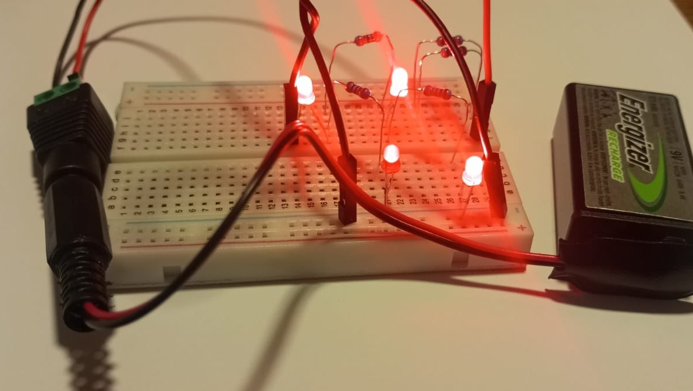
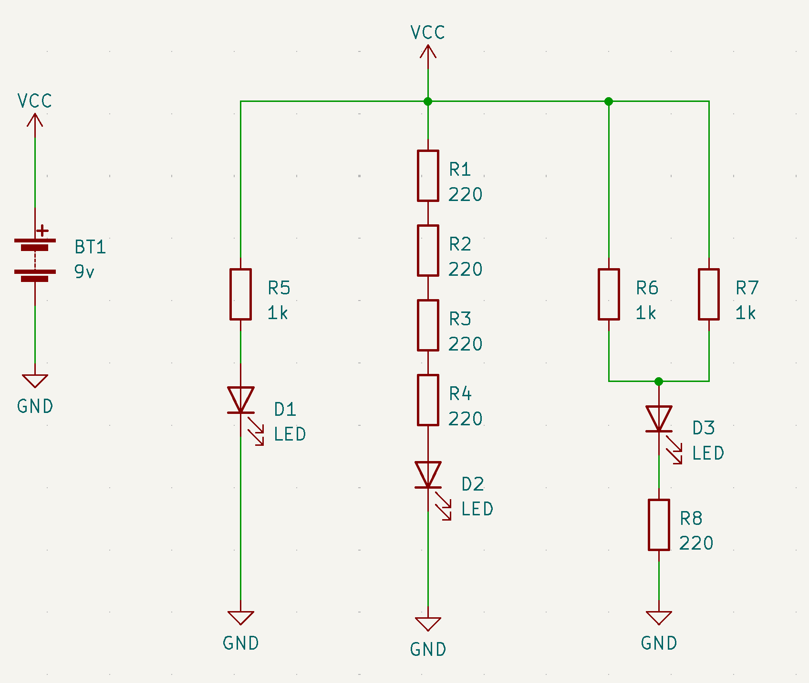
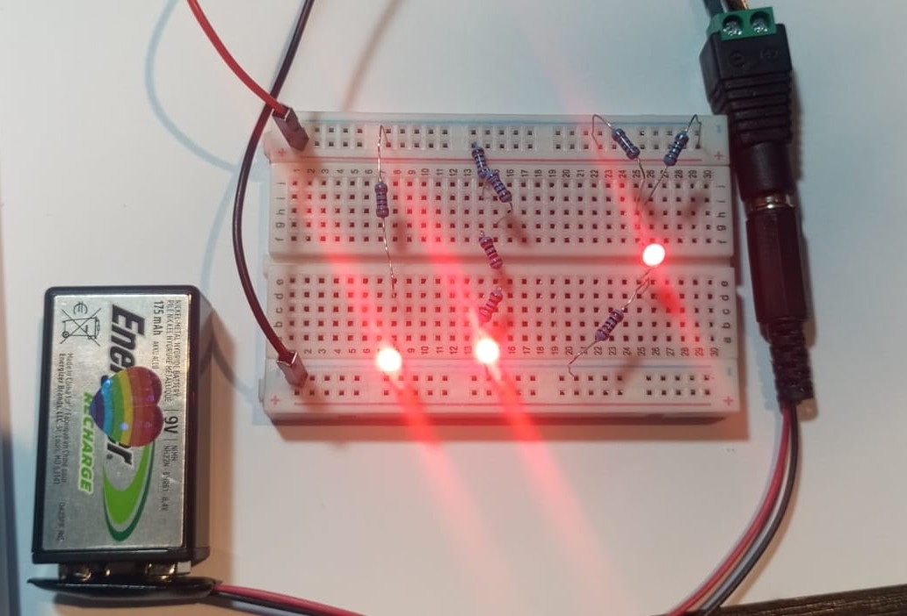

# sesion-02b

- hi hat 808

- TB303

- [Daft Punk - Around The World](https://www.youtube.com/watch?v=K0HSD_i2DvA)

- [tutupá misaa](https://vimeo.com/matiasserranoacevedo)
- solenoide
- poesía - poíēsis - creación o hacer
- david tudor - reminded by the instruments - rainforest moma
- john widlar
- [node.js](https://nodejs.org/en)
- [plantillas para tablas markdown](https://www.tablesgenerator.com/markdown_tables)

## BOM - Bill Of Materials

| tipo        | Qty      | nombre/etiqueta | valor |
|-------------|----------|-----------------|-------|
| elemento    | cantidad |                 | V/Ohm |
| resistencia | 4        | R1 R2 R3 R4     | 220   |

una tabla muy práctica, ordena elementos y ayuda con presupuestos

## circuitos y actividades

### LQXTLC

consiste en ir sacando resistencias y ver qué pasa con las leds ¿se apaga o se mantiene prendida? ¿aumenta o baja la luz?

### 00

**BOM**

| tipo         | Qty | nombre/etiqueta | valor     |
|--------------|-----|-----------------|-----------|
| resistencias | 3   | R1 R2 R3        | 1k        |
| LED roja     | 4   | D1 D2 D3 D4     | 1.8 - 2.1 |
| batería      | 1   | bat             | 9v        |

### 01

**BOM**

| tipo         | Qty | nombre/etiqueta | valor        |
|--------------|-----|-----------------|--------------|
| resistencias | 5   | R1 R2 R3 R4 R5  | 220x4 - 1kx1 |
| LED roja     | 4   | D1 D2 D3 D4     | 1.8 - 2.1    |
| batería      | 1   | bat             | 9v           |

| LQXTLC | D1 | D2 | D3 | D4 |
|--------|----|----|----|----|
| R1     | 0  | 0  | 0  | 0  |
| R2     | 1  | 0  | 0  | 1  |
| R3     | 1  | 1  | 1  | 0  |
| R4     | 1  | 1  | 1  | 0  |
| R5     | 1  | 0  | 0  | 1  |

### 02

**BOM**

| tipo         | Qty | nombre/etiqueta   | valor     |
|--------------|-----|-------------------|-----------|
| resistencias | 6   | R1 R2 R3 R4 R5 R6 | 220       |
| LED roja     | 4   | D1 D2 D3 D4       | 1.8 - 2.1 |
| batería      | 1   | bat               | 9v        |

| LQXTLC | D1 | D2 | D3 | D4 |
|--------|----|----|----|----|
| R1     |1   |1   |1   |1   |
| R2     |1   |1   |1   |1   |
| R3     |1   |1   |0   |1   |
| R4     |1   |0   |3   |4   |
| R5     |1   |1   |1   |0   |
| R6     |1   |1   |1   |1   |

### 03

**BOM**

| tipo         | Qty | nombre/etiqueta         | valor        |
|--------------|-----|-------------------------|--------------|
| resistencias | 8   | R1 R2 R3 R4 R5 R6 R7 R8 | 220x5 - 1kx3 |
| LED roja     | 3   | D1 D2 D3                | 1.8 - 2.1    |
| batería      | 1   | bat                     | 9v           |

| LQXTLC | D1 | D2 | D3 |
|--------|----|----|----|
| R1     | 1  | 0  |1   |
| R2     |1   |1   |1   |
| R3     |1   |0   |1   |
| R4     |1   |1   |1   |
| R5     |0   |1   |1   |
| R6     |1   |1   |1   |
| R7     |1   |1   |1   |
| R8     |1   |1   |0   |