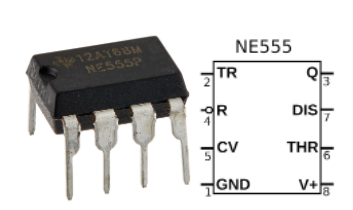
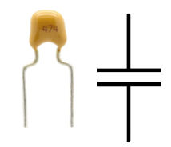
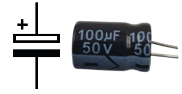
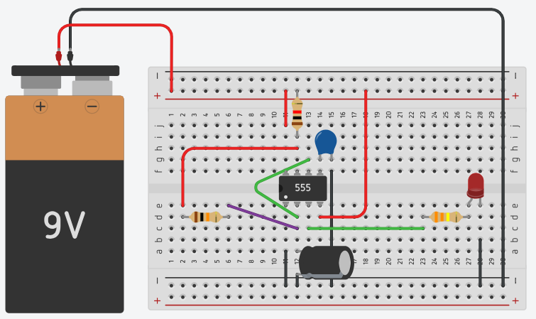
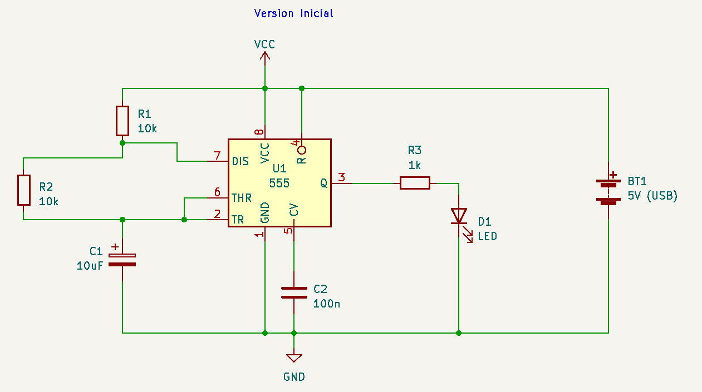
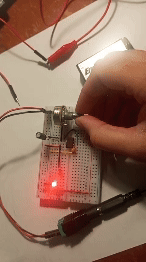

# sesion-03a

- *[suzanne ciani](https://www.youtube.com/watch?v=nJWk7jiASP0)*
- delia derbyshire
- sisters with transistors - documental
- daphne oram
- eliane radigue - trilogie de la muerte

## circuitos

- VCC = votaje de corriente continua = positivo
- resistencias en serie Req (resistencia equivalente) = R1 + R2
- resistencias en paralelo 1/Req = 1/R1 + 1/R2 (si son resistencias iguales la equivalencia es la mitad)

## prefijos notación científica

- 1 x 10^12 = 0,000000000001 = 1 p (pico)
- 1 x 10^-9 = 0,000000001 = 1 n (nanno)
- 1 x 10^-6 = 0,000001 = 1 μ (micro)
- 1 x 10^-3 = 0,001 = 1 m (mili)
- 1x 10^0 1 = 1 u (unidad)
- 1 x 10^3 1.000 = 1 k (kilo)
- 1 x 10^6 1.000.000 = 1 M (mega)
- 1 x 10^9 1.000.000.000 = 1 G (giga)

## elementos nuevos

### cirtuito LM 555

" todo esto funciona con magia, cuando sale el humito, se va el humo mágico y no funciona, no se puede volver a meter"

- proporciona retardos de tiempo, como un circuitto integrado flipflop (almacena y cambia el estado de señal digital)
- *[datasheet - manual](https://www.ti.com/lit/ds/symlink/ne555.pdf)*
-  

### condensador

almacena voltaje

#### cerámico 474

*47* = dígito *4* 0s = 470.000 p = 470 n = 0,47

#### condensador electrolítico

1 μF - 10 μF - 100 μF

## 1er circuito con 555

| **TIPO**                  | **VALOR**    | **CANTIDAD** |
| ------------------------- | -----------  | ------------ |
| Circuito integrado        | NE555        | 1            |
| Protoboard                |              | 1            |
| LED                       | rojo         | 1            |
| Resistencia               | 10k          | 2            |
| Resistencia               | 1k           | 2            |
| Potenciómetro             | B500k        | 1            |
| Condensador cerámico      | 470nF (474)  | 2            |
| Condensador electrolítico | 10uF         | 2            |

> **ATENTO A DONDE PONES LOS CABLES**

> **revisar muy bien el valor de los componentes**

> **revisar muy bien las conexiones**

los condensadores electrolíticos TIENEN polaridad. si no se ponen correctamente EXPLOTAN

el LED se enciende y se apaga de forma constante. dependiendo del condensador, el tiempo de parpadeo aumenta o disminuye

con 10 μF es más rápido que con 100 μF, con 1 μF parpadea tan rápido que sólo se ve encendida

## 1 μF

## 10 μF

## 100 μF

## potenciómetro B500k

condensador electrolítico 1 μF + con el potenciómetro se puede controlar la velocidad de parapdeo

## encargo-06

### einstrürzende neubauten

grupo musical formado en Berlín, 1980. se podría clasificar usualmente como industrial o electrónica, pero esos estilos no llegan a describir su sonido. usan instrumentos y sonidos que ellos mismos fabricaron, acompañados de instrumentos tradicionales como guitarra, bajo y sintetizadores. pertenecieron al movimiento dadaísta Die Geniale Dilletanten, que tenía el objetivo de revolucionar lo musical usando sierras, palas, taladros y otras herramientas de construcción como instrumentos musicales.

Escuché el álbum "silence is sexy". la canción, con el mismo nombre, me incomodó mucho, sentía que tenía que escuchar algo que no había, me generó una sensación muy extraña, casi desagradable. "in circles" también me generó una sensación desagradable. prácticamente todo el álbum lo hizo.

### stereolab

grupo británico de rock formado en Londres en 1990. su estilo combina la música lounge e easy-listening de los años 50 y 60 con influencias del krautrock y el pop de los años 60, entre otros. se les aplicó la etiqueta "post-rock". usan antiguos instrumentos de teclado analógicos tales como sintetizadores Moog y órganos eléctricos Farfisa y Vox.
se inspiran en el género krautrock, como las bandas Can, Kraftwerk y Neu!; el pop de los 60; el rock experimental como Syd Barrett y The Velvet Underground.

Me pareció agradable su música, guardé varias en mi playlist, escuché el álbum "little pieces of stereolab (a switched on sampler)" y un sencillo que me gustó mucho llamado "lo boob oscillator"