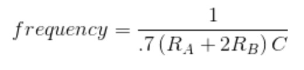
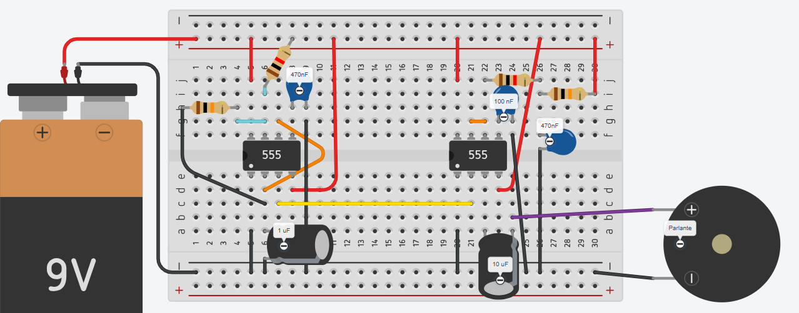
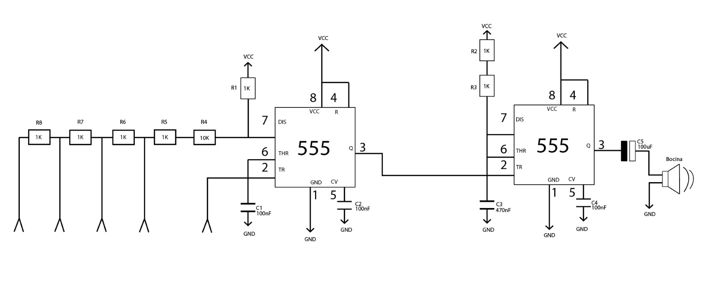

# Proyecto 01

## Grupo 6

Antonia Fuentealba

Sofía Pérez

Félix Rodríguez

Izhak Villegas

## PREMISA/PLANTEAMIENTO

¿Cómo podríamos modificar un APC para que sea lo más parecido posible a un instrumento musical tradicional?

En este proyecto nos planteamos la idea y la duda de cómo las frecuencias de las notas musicales podrían ser replicadas, a través de un circuito electrónico a partir de un _Atari Punk Console_.

¿Cómo se genera una nota musical?

Una nota musical es una vibración del aire a una cierta frecuencia (medida en Hertz). Por ejemplo, la nota La (A4) vibra a 440 Hz.

La APC genera ondas cuadradas con frecuencias variables. Esas ondas sonoras entran en un altavoz, el cual vibra a esa frecuencia, y nuestro oído lo percibe como una nota.

Es por esto que nuestra decisión fue modificar el APC  para generar notas musicales a través de cables que conectan ondas eléctricas de distintos objetos, ya sean orgánicos o metálicos, simulando de esta forma una especie de teclado, que gracias a la suma de resistencias genera una frecuencia más grave o más aguda dependiendo del objeto que transmite la onda. Esto a través de un circuito que sería astable, debido a sus estados de on/off, al momento de presionar botones y accionar los clables en contacto con objetos. Además es un circuito robusto, que no es frágil en su fisicalidad, ya que cuenta con una carcasa exterior impresa ne 3d que protege el circuito solsdado en la pcb.

“Cada nota musical tiene una frecuencia principal, que indica cuántas veces por segundo vibra el elemento que la produce. La frecuencia producida por un temporizador 555 en modo astable depende de los valores del condensador (C) y dos resistencias (R A  y R B )”
Instructables. (2024, 6 marzo).
Simple Electronic piano. Instructables. <https://www.instructables.com/Simple-Electronic-Piano/>

Esta relación es:

### ANATOMÍA FÍSICA, DIAGRAMAS, ILUSTRACIONES, TEXTO

### CAJA NEGRA (ANATOMÍA FÍSICA)

## Teclado musical APC

Cuenta con una carcasa, con 5 orificios (sin contar el parlante ni el conector a la batería), por donde salen cables que se conectan a caimanes y a su vez, a objetos metálicos y orgánicos, también un botón, cables y un potenciómetro que, al accionar cada uno de estos, genera una frecuencia distinta, la cuales son capaces de oírse a través de una bocina o parlante.
La carcasa contiene el circuito soldado a la placa perfboard con todos los componentes utilizados (BOM)

[Imágenes del teclado musical y sus partes]

### DIAGRAMA

A continuación se presenta el esquemático realizado para la construción del circuito e ilustraciones del planteamiento de cómo sería esta esquematización.

## BITÁCORAS

### Bitácora Anto

### Bitácora Sofía

### Bitácora Izhak

### Bitácora y proceso Félix

## PROCESOS

[Videos de muestra del proceso en _Proto_]

<https://github.com/user-attachments/assets/790efdef-d78c-4d19-b25d-af472468af7d>

<https://github.com/user-attachments/assets/fc261a51-aa6d-4029-83d4-fa57e76a6de4>

## ESQUEMÁTICO ELÉCTRICO, BILL OF MATERIALS, CITAS Y REFERENCIAS

## BILL OF MATERIALS (B.O.M)

| Tipo                  | Cantidad | Nombre                  | Valor      |
|-----------------------|----------|-------------------------|------------|
| Perforated board      | 1        | PB                      |            |
| Batería               | 1        | BAT.                    | 9 V        |
| Resistencias          | 8        | R1, R2, R3, R5, R6, R7, R8 | 1k      |
| Resistencias          |          | R4                      | 10k        |
| Condensador cerámico  | 3        | C1, C2, C4              | 100nF      |
| Condensador electrolítico   | 1  | C5                      | 100uF      |
| Condensador           | 1        | C3                      | 470nF (474)|
| Jumpers               | 12-17    |                         |            |
| Bocina                | 1        | Speaker                 | 0.5W/8Ω    |
| Caimanes              | 5        |                         |            |
| Circuito integrado    | 2        | Chip 1, Chip 2          | 555        |

Para nuestro proceso nos referenciamos en el piano electrónico creado por Joshua Brooks.

"La electrónica puede producir sonidos muy fácilmente con solo unas pocas piezas".

<https://www.instructables.com/Simple-Electronic-Piano/>

## CONCLUSIÓN

Finalmente a la hora de probar por primera vez nuestro circuito nos dimos cuenta que no funciona
¿qué errores hay?, ¿son solucionables?, ¿se puede llegar al resultado deseado?
Pedir retroalimentación.