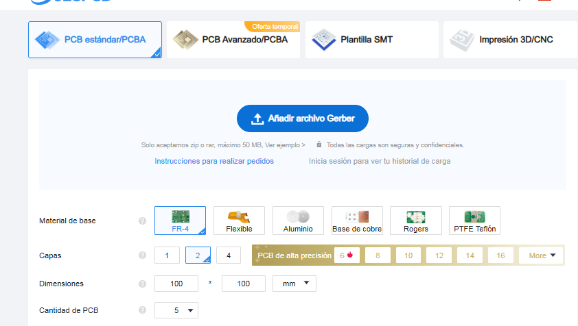
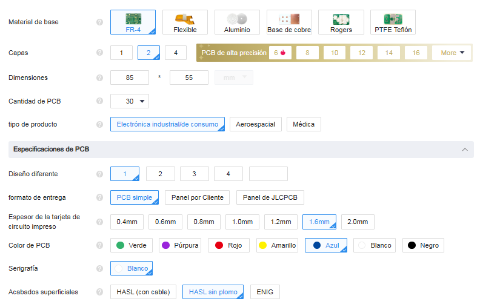
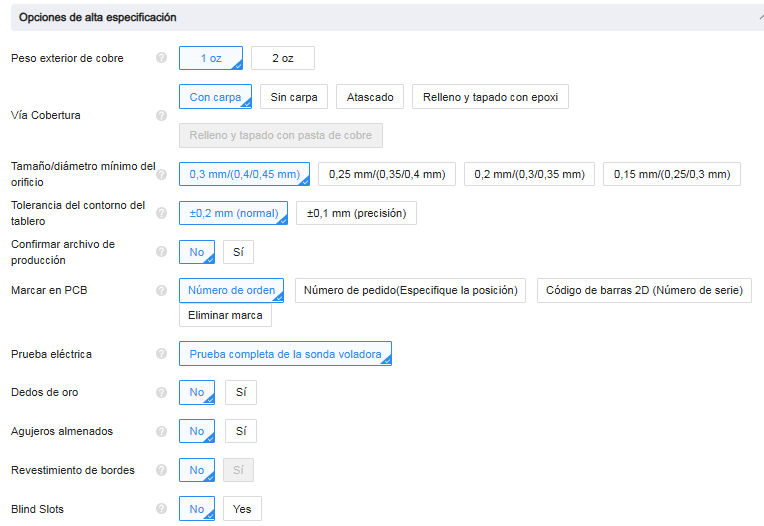

# sesion-07b

viernes 25 de abril

> aquí están los nombres de las huellas de los componentes

- <https://vertice.udp.cl/> - **fondo vértice** financiamiento de proyectos UPD
- [cursos online](https://www.coursera.org/)
- [KiCAD en 3D](https://www.kicad.org/external-tools/stepup/) - mejor hacerlo en la app directamente
- <https://cdm.link/> diversidad de musica electrónica - cómo destruir metáforas violentas [maestro - esclavo]
- circuito integrado 4017

- cómo saber si mi circuito funciona o no: poner un led

- usar terminal block para conectar componentes externos (caimanes) TerminalBlock:TerminalBlock_MaiXu_MX126-5.0-02P_1x02_P5.00mm
- **diodo de protección** Diode_THT:D_DO-41_SOD81_P10.16mm_Horizontal

agregar la carpeta de discord para las huellas del 555 y otros archivos compartidos por misa

## huellas

## cambiar huellas: [F]

- resistencia axial
- capacitor cerámico: Capacitor_THT:C_Disc_D6.0mm_W2.5mm_P5.00mm
- capacitor polarizado: Capacitor_THT:CP_Radial_D6.3mm_P2.50mm
- diode: Diode_THT:D_DO-41_SOD81_P10.16mm_Horizontal
- *LED: LED_THT:LED_D5.0mm
- **speaker - usar terminal block:** TerminalBlock:TerminalBlock_MaiXu_MX126-5.0-02P_1x02_P5.00mm
- caimanes: modules_teee2025:caiman
- switch: modules_teee2025:SPDT_PCB_small_P2.5mm

se puede configurar la página para impresión

## en el visor de huellas

tamaño tarjeta de presentación: 85 x 55

- asignar huellas [A]
- editar tamaño de pista

- si se hacen cambios en el esquema --> actualizar placa de componentes

- cambiar a lado superior para pasar sobre otras vías [V]
- SIEMPRE INDICAR POLARIDAD - herramienta texto - cambiar capa a "(F o B)silkscreen"

)

## agregar imágenes

1. d
2. conversor de imágenes en el inicio - perfecto para logos - imágenes complejas - siempre elegir la capa

## comprar en JLCPCB

- cambiar envío
- cambiar grosor de placa
- cambair color

## EXPORTAR

- exportar gerber .gbr
- 7 capas importantes
- .drl no sé qué cosa de taladrear

los componentes tienen:

- Nombre

- resistencia
- condensador
- LED
- etc.

- Valor

- 100k ohm (de una resistencia)
- 10 uF (de un condensador)
- NE555P (de un circuito integrado)
- etc.

**- Encapsulado :** forma física - espacio

- axial 1/4 w 6.5mm (resistencia de 100k)
- radial D6.3mm P2.5mm (condensador electrolítico de 10uF)
- DIP-8 (circuito integrado de 8 pines de tipo THT)
- etc.

 D : diámetro

 P : Pitch - distancia entre patitas

 DIP : Dual In Line - package de circuitos integrados

 para saber el encapsulado de los componentes, googlear "Package *componente + valor*"

---

## encargo-16: cotizar udpudu en JLCPCB de forma productiva

hacerse una cuenta en JLCPCB y cotizar udpudu, para 30 personas, documentar cada parámetro y elección.

Hay que subir la carpeta zip de gerber a la página

Puse la opción de 2 capas porque en este caso no necesitamos más, sólo Front y Back. En tipo de producto es el "electronica industrial/de consumo" porque la aeroespacial y médica está en otro nivel demasiado específico para lo que lo vamos a usar nosotros. En espesor puse 1.6mm porque es el más barato. Quise poner la placa en azul porque es mi color favorito.

## encargo-17: cotizar udpudu en JLCPCB de forma experimental

probar opciones que no entiendan, documentar otros parámetros que no conozcan aún.

