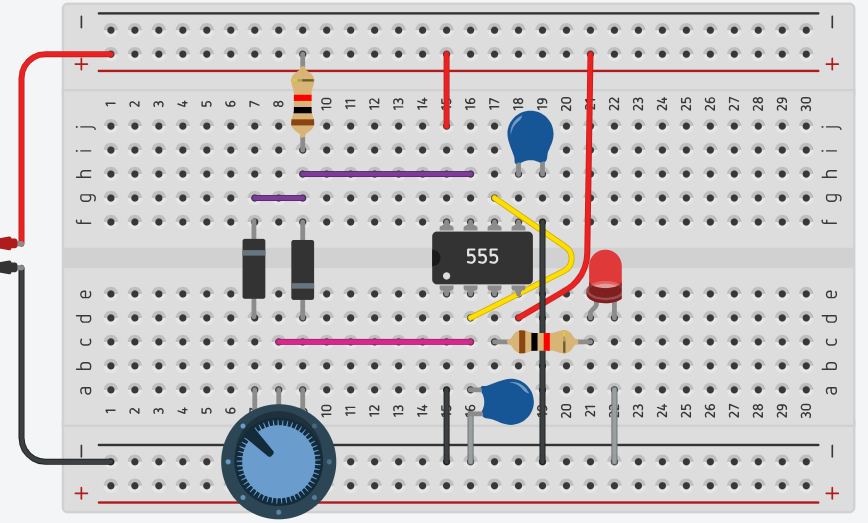
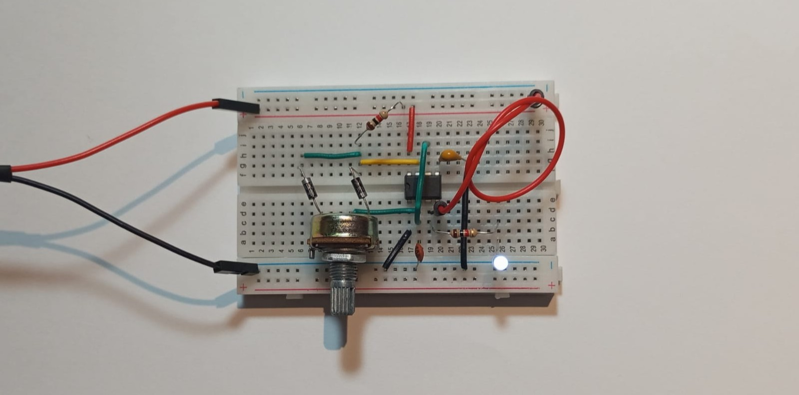

# sesion-09b

TODOS olvidamos nuestros materiales, así que trabajamos en Tinkercad

## circuito PWM

| **TIPO**                  | **VALOR**    | **CANTIDAD** |
| ------------------------- | -----------  | ------------ |
| Circuito integrado        | NE555        | 1            |
| Batería   | 1 | 9V    |
| Protoboard                |              | 1            |
| LED                       | rojo         | 1            |
| Resistencia               | 1k           | 2            |
| Potenciómetro             | B500k        | 1            |
| Condensador cerámico      | 100nF  | 2   |
| Diodo |   | 2 |

## Encargo 18

## encargo-19: cultura electrónica y laurie anderson

estudiar la obra de laurie anderson, incluir citas y referentes usados, explicar qué y por qué les gusta o no de su trabajo.