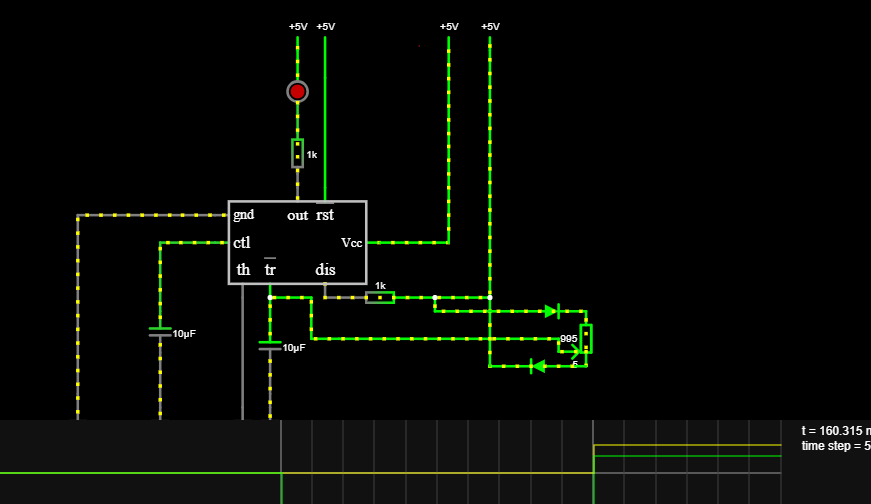

# sesion-10a

- filósofo descartes
- descartes - silvio rodríguez
- <https://www.falstad.com/circuit/>
- si googleas "pinout" se sabe la función de cada patita
- "la batería es un lienzo"

## circuito PWM

1. armar 1 circuito
2. juntarse entre 3 personas, c/u con un LED rojo, verde o azul
3. combinar colores

pin 5 del 555 - control de voltaje, es inestable, por eso se usa un condensador

___

## lm324 - amplificador operacional (OP-AMP)

"el comparador de minecraft está inspirado en eso"

"caja negra llena de transistores"

chip de 14 patitas

muy usado

puede usar alimencación bipolar "es un cacho"

## divisor de voltaje

divisor de voltaje

si quiero dividir a la mitad el voltaje de la batería, pongo una resistencia en cada lado

## falstad

### cómo agregar un osciloscopio

## circuito RLC

## Encargo

pantallas de segmentos y cuántos tienen

## encargo - 21

